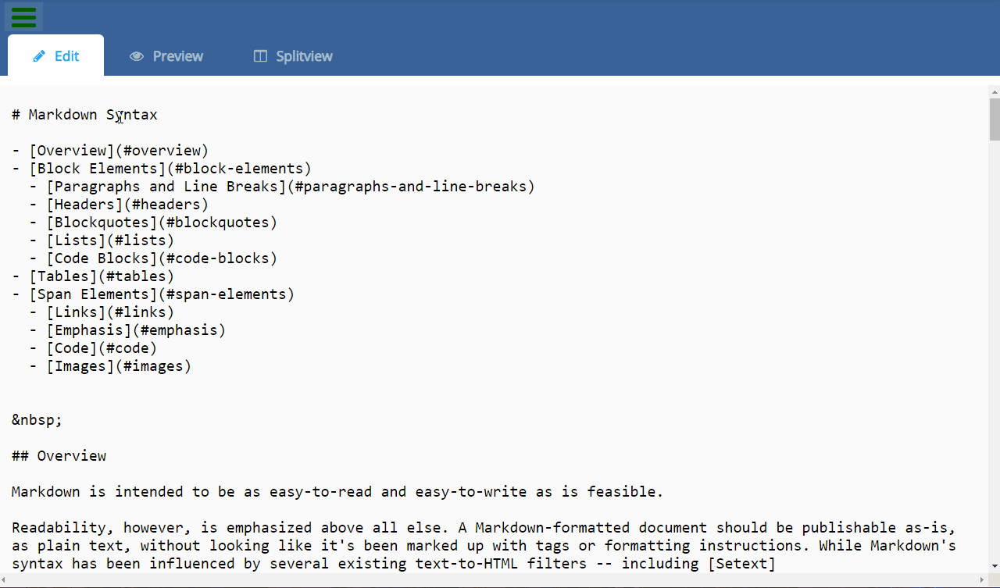

# Markdown Previewer
### About the project

it's a freecodecamp project in the "Front End Libraries Projects" module, you have to build a Markdown Previewer.  

### Tools used

**Front-end:** React

### Screenshot



### Link

https://codepen.io/B-Tarik/full/WmNePp

### User stories

1. I can see a textarea element with a corresponding ```id="editor"```.
2. I can see an element with a corresponding ```id="preview"```.
3. When I enter text into the ```#editor``` element, the ```#preview``` element is updated as I type to display the content of the textarea.
4. When I enter GitHub flavored markdown into the ```#editor``` element, the text is rendered as HTML in the ```#preview``` element as I type (HINT: You don't need to parse Markdown yourself - you can import the Marked library for this: https://cdnjs.com/libraries/marked).
5. When my markdown previewer first loads, the default text in the ```#editor``` field should contain valid markdown that represents at least one of each of the following elements: a ```header``` (H1 size), a ```sub header``` (H2 size), a ```link```, ```inline code```, a ```code block```, a ```list item```, a ```blockquote```, an ```image```, and ```bolded text```.
6. When my markdown previewer first loads, the default markdown in the ```#editor``` field should be rendered as HTML in the ```#preview``` element.
7. Optional Bonus (you do not need to make this test pass): When I click a link rendered by my markdown previewer, the link is opened up in a new tab (HINT: read the Marked.js docs for this one!).
8. Optional Bonus (you do not need to make this test pass): My markdown previewer interprets carriage returns and renders them as br (line break) elements.